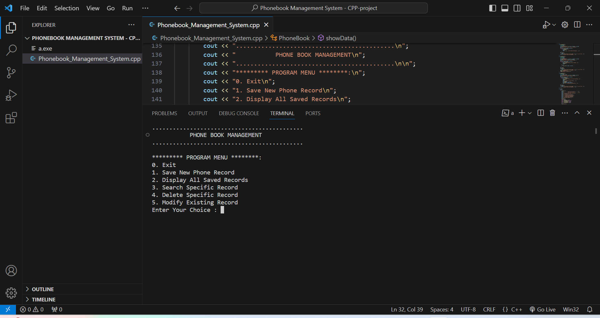
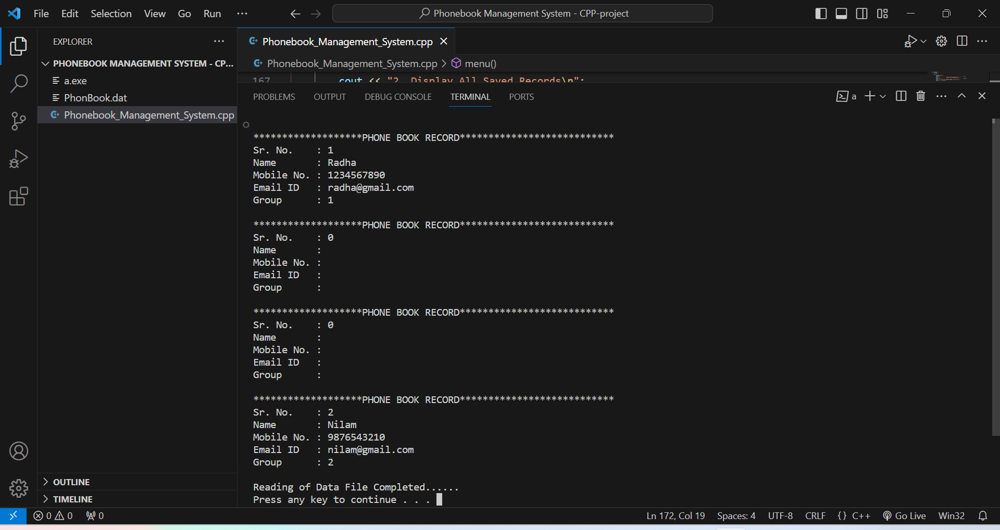
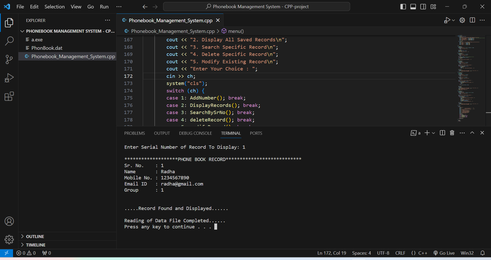

# Phonebook Management System

This is a simple console-based phonebook management system implemented in C++. It allows users to save, display, search, delete, and modify phonebook records.

## Features

- **Add New Record**: Save new phonebook records with a serial number, name, mobile number, email, and group.
- **Display All Records**: View all saved phonebook records.
- **Search Record by Serial Number**: Search for a specific phonebook record by its serial number.
- **Delete Record**: Remove a specific phonebook record by its serial number.
- **Modify Record**: Update the details of an existing phonebook record.


## How to Use

1. Clone the repository:

    ```bash
    git clone https://github.com/ashuupatil07/Phonebook_Management_System.git
    ```

2. Compile the program:

    ```bash
    g++ Phonebook_Management_System.cpp
    ```

3. Run the program:

    ```bash
    ./a
    ```


4. Follow the on-screen instructions to navigate through the menu and perform various operations.

## Contributing

Contributions are welcome! Feel free to open an issue or submit a pull request.

## Authors

- Ashwini Patil.

## Acknowledgments

- Mention any libraries or resources used in the project.
- Inspiration, etc.



